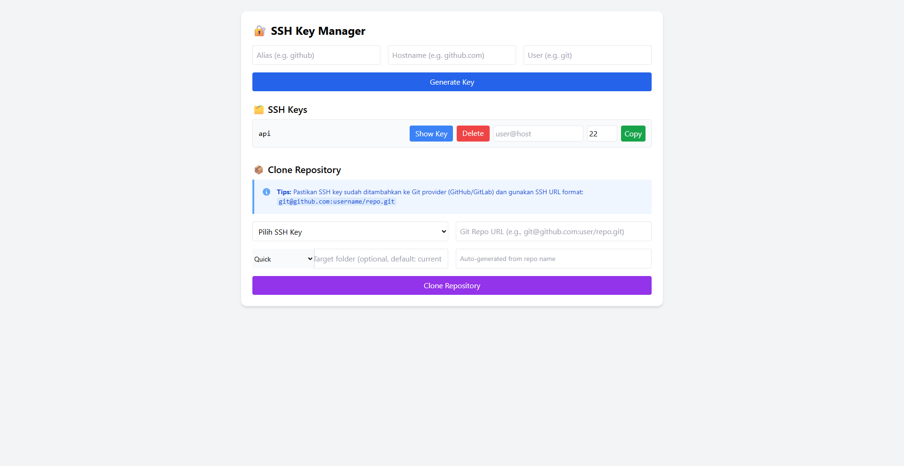

# SSH Key Manager

Sebuah aplikasi web Flask yang memungkinkan Anda untuk mengelola SSH keys dan melakukan clone repository Git dengan mudah.

## Fitur Utama

### 🔑 Manajemen SSH Key
- **Generate SSH Key**: Buat SSH key baru dengan alias yang mudah diingat
- **View SSH Keys**: Lihat daftar semua SSH keys yang tersedia
- **Show Key Content**: Tampilkan isi SSH key dalam modal yang responsif
- **Copy to Clipboard**: Salin SSH key ke clipboard dengan satu klik
- **Delete SSH Key**: Hapus SSH key yang tidak diperlukan

### 📁 Clone Repository
- **SSH Key Selection**: Pilih SSH key dari dropdown untuk autentikasi
- **Auto-generate Folder Name**: Nama folder otomatis berdasarkan nama repository
- **Target Folder Selection**: Pilih lokasi tujuan dengan quick select atau input manual
- **Detailed Clone Results**: Tampilkan hasil clone dengan path lengkap dan status

## Screenshot

### Halaman Utama


*Tampilan utama aplikasi SSH Key Manager dengan fitur lengkap untuk mengelola SSH keys dan clone repository Git. Interface yang clean dan user-friendly dengan form generate SSH key, daftar keys yang tersedia, dan form clone repository dengan target folder selection.*

## Instalasi

1. **Clone repository ini**:
   ```bash
   git clone <repository-url>
   cd ssh-keygen-generate
   ```

2. **Install dependencies**:
   ```bash
   pip install flask
   ```

3. **Jalankan aplikasi**:
   ```bash
   python run.py
   ```

4. **Buka browser** dan akses `http://127.0.0.1:5000`

## Penggunaan

### Membuat SSH Key Baru
1. Masukkan alias untuk SSH key (contoh: `github-personal`)
2. Klik tombol "Generate SSH Key"
3. SSH key akan dibuat di folder `~/.ssh/`

### Clone Repository
1. Pilih SSH key dari dropdown
2. Masukkan URL repository Git (format SSH: `git@github.com:user/repo.git`)
3. Pilih target folder (opsional):
   - Gunakan quick select untuk folder umum
   - Atau ketik path manual
4. Nama folder akan auto-generate dari nama repository
5. Klik "Clone Repository"

### Quick Select Target Folders
- **C:\\Projects**: Folder untuk proyek development
- **C:\\laragon\\www**: Folder untuk proyek web Laragon
- **D:\\Projects**: Alternatif di drive D
- **Desktop**: Folder desktop user

## Struktur File

```
ssh-keygen-generate/
├── run.py              # Aplikasi Flask utama
├── templates/
│   └── index.html      # Template HTML
├── img/                # Folder screenshot
│   └── screenshot-page.png
└── README.md           # Dokumentasi ini
```

## Fitur Keamanan

- **Host Key Verification**: Bypass otomatis untuk kemudahan development
- **SSH Key Validation**: Validasi keberadaan SSH key sebelum clone
- **Error Handling**: Penanganan error yang informatif
- **Path Security**: Validasi path untuk mencegah directory traversal

## Troubleshooting

### Error: "Failed to clone repo"
1. Pastikan SSH key sudah ditambahkan ke Git provider (GitHub/GitLab)
2. Gunakan format URL SSH yang benar: `git@github.com:user/repo.git`
3. Periksa koneksi internet dan akses ke repository

### Error: "SSH key not found"
1. Pastikan SSH key sudah di-generate terlebih dahulu
2. Periksa folder `~/.ssh/` untuk memastikan file ada

## Teknologi yang Digunakan

- **Backend**: Flask (Python)
- **Frontend**: HTML, CSS (Tailwind CSS), JavaScript
- **SSH**: OpenSSH untuk generate dan manage keys
- **Git**: Git command line untuk clone operations

## Kontribusi

Kontribusi sangat diterima! Silakan buat issue atau pull request untuk perbaikan dan fitur baru.

## Lisensi

MIT License - Silakan gunakan dan modifikasi sesuai kebutuhan.

---

**Catatan**: Aplikasi ini dibuat untuk development environment. Untuk production, pastikan untuk menambahkan security measures yang sesuai.